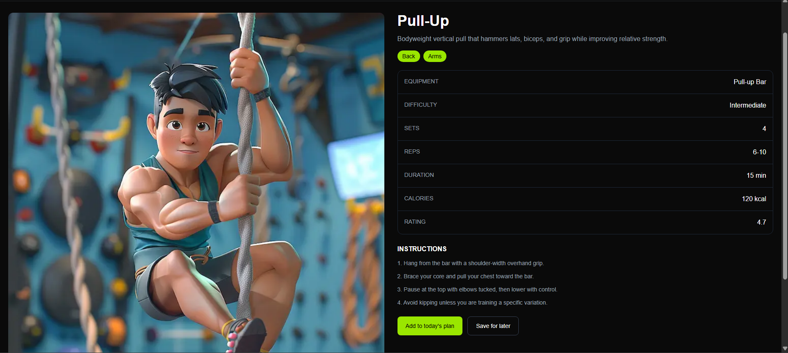
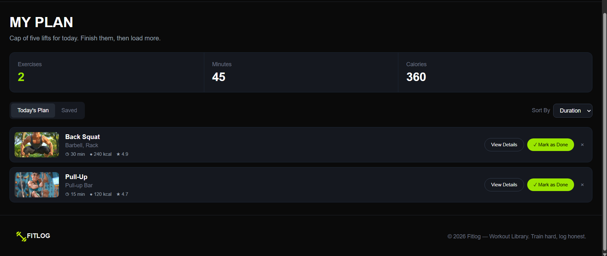

# 🏋️ FitLog — Workout Library & Planner

> **Train with intent. Log every set.**

FitLog is a modern workout planning web application designed to help users discover exercises, organize their daily workout plan, and save workouts for later.

🔗 **Live Demo:** https://fitlog-bice-eight.vercel.app/

---

## ✨ Features

### 1. 🏋️ Workout Library

Browse a collection of workouts covering major muscle groups such as chest, back, legs, arms, shoulders, and core.

Each workout provides useful information including:

* Exercise name
* Target muscle groups
* Equipment
* Duration
* Calories burned
* Difficulty
* Rating
* Sets & reps
* Instructions

### 2. 📋 Create Your Workout Plan

Add workouts to your **My Plan** section and build a personalized workout routine based on your goals.

### 3. ❤️ Save Favorite Workouts

Save workouts that you want to revisit later and easily access them from the **Saved** section.

### 4. 🔍 Search, Filter & Sort Workouts

Quickly find suitable exercises by searching and filtering the workout library. Workouts can also be sorted based on useful metrics such as duration and calories burned.

### 5. 📱 Responsive & Modern UI

FitLog features a clean, dark-themed interface designed to provide a focused workout experience across different screen sizes.

---

## 📸 Screenshots

### Exercise Library



### Workout Log



---

## 🛠️ Technologies Used

| Technology         | Purpose                                      |
| ------------------ | -------------------------------------------- |
| **Next.js**        | React framework and application architecture |
| **React**          | Building reusable UI components              |
| **TypeScript**     | Type-safe development                        |
| **Tailwind CSS**   | Styling and responsive layouts               |
| **React Toastify** | User feedback and notifications              |
| **REST API**       | Fetching workout data                        |
| **Next/Image**     | Optimized image rendering                    |
| **Vercel**         | Deployment and hosting                       |

---

## 🧠 What I Practiced

This project helped me practice several important concepts in modern React and Next.js development:

* Next.js App Router
* Server and Client Components
* React Context API
* Shared state management
* `useState`, `useEffect`, and `useMemo`
* TypeScript interfaces and type safety
* API data fetching
* Dynamic routing
* Responsive design with Tailwind CSS
* Reusable component architecture
* Working with external APIs
* Deploying a Next.js application with Vercel

---

## 🚀 Getting Started

### 1. Clone the repository

```bash
git clone https://github.com/your-username/your-repository-name.git
```

### 2. Navigate to the project

```bash
cd your-repository-name
```

### 3. Install dependencies

```bash
npm install
```

### 4. Start the development server

```bash
npm run dev
```

### 5. Open the application

Visit:

```text
http://localhost:3000
```

---

## 📂 Project Structure

```text
fitlog/
├── app/
│   ├── workouts/
│   ├── plan/
│   ├── layout.tsx
│   └── page.tsx
│
├── components/
├── context/
│   └── PlanContext.tsx
│
├── types/
│   └── index.ts
│
├── utils/
│   └── api.ts
│
├── assets/
│   ├── exercise.png
│   ├── log.png
│   └── logo.png
│
├── public/
└── README.md
```

---

## 🌐 Live Project

**FitLog:** https://fitlog-bice-eight.vercel.app/

---

## 👨‍💻 Author

**Abu Raihan Tashin**

Computer Science Undergraduate at BRAC University

> **Learning. Improving. Delivering with integrity.**

---

⭐ If you like this project, consider giving the repository a star!
